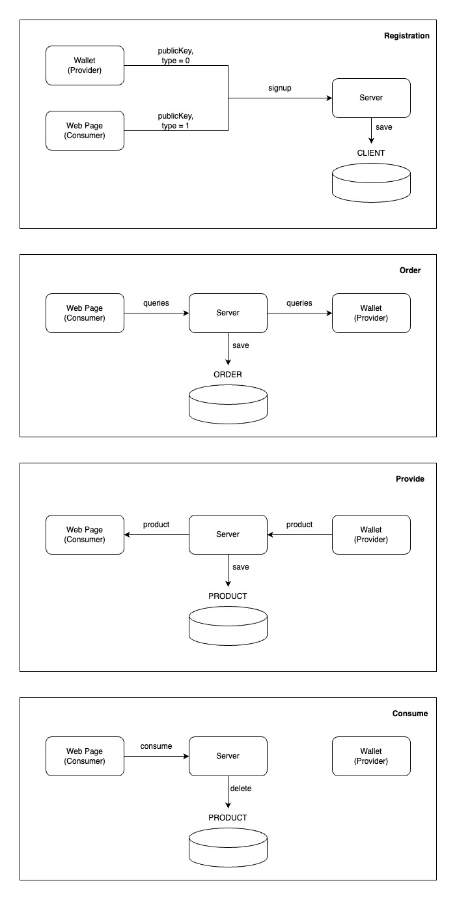

# Data Sales Platform Demo

## DB
### table_client
| property | type | description |
| --- | --- | --- |
| publicKey(PK) | String | Base64-encoded text of clien'ts public key |
| type | Integer | 0: Provider, 1: Consumer |
| name | String | name of the client |
| createdAt | Long | timestamp of creation |

### table_order
| property | type | description |
| --- | --- | --- |
| id(PK) | String | UUIDv4 identifier |
| sender | String | publicKey of the consumer client who made the order |
| queries | List(String) | the data queries of the order |

### table_product
| property | type | description |
| --- | --- | --- |
| id(PK) | String | UUIDv4 identifier |
| orderId(FK) | String | id of the corresponding order |
| sender | String | publicKey of the provider client who made the product |
| recipient | String | publicKey of the consumer client who requested the product |
| data | String | the actual data of the product |
| createdAt | Long | timestamp of creation |

---

## Major Logics
